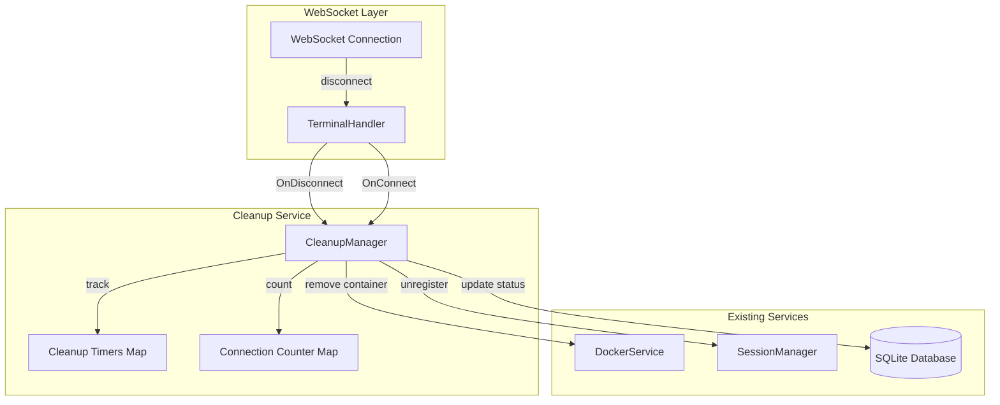

# Design Document: Container Cleanup

## Overview

本设计实现用户下线后的容器自动清理机制。核心思路是在用户WebSocket断开时启动一个20分钟的定时器，如果用户在此期间未重连，则自动清理其Docker容器。

系统需要追踪每个容器的连接数（支持多标签页），只有当所有连接都断开时才启动清理定时器。

## Architecture



## Components and Interfaces

### 1. CleanupManager (新增)

负责管理容器清理定时器和连接计数。

```go
// CleanupManager manages container cleanup timers
type CleanupManager struct {
    mu              sync.RWMutex
    timers          map[string]*time.Timer    // containerID -> cleanup timer
    connectionCount map[string]int            // containerID -> active connection count
    dockerSvc       *DockerService
    db              *sql.DB
    cleanupDelay    time.Duration             // default: 20 minutes
}

// NewCleanupManager creates a new cleanup manager
func NewCleanupManager(dockerSvc *DockerService, db *sql.DB) *CleanupManager

// OnConnect is called when a user connects to a container
func (cm *CleanupManager) OnConnect(containerID string)

// OnDisconnect is called when a user disconnects from a container
func (cm *CleanupManager) OnDisconnect(containerID string)

// CancelCleanup cancels any pending cleanup for a container
func (cm *CleanupManager) CancelCleanup(containerID string) bool

// GetConnectionCount returns the current connection count for a container
func (cm *CleanupManager) GetConnectionCount(containerID string) int

// HasPendingCleanup checks if a container has a pending cleanup timer
func (cm *CleanupManager) HasPendingCleanup(containerID string) bool
```

### 2. TerminalHandler (修改)

修改现有的TerminalHandler，在连接建立和断开时通知CleanupManager。

```go
type TerminalHandler struct {
    dockerSvc     *service.DockerService
    cleanupMgr    *service.CleanupManager  // 新增
}

// Handle 方法中添加:
// - 连接建立时调用 cleanupMgr.OnConnect(containerID)
// - 连接断开时调用 cleanupMgr.OnDisconnect(containerID)
```

### 3. DockerService (无修改)

现有的DockerService已经提供了所需的容器操作方法：
- `StopContainer(ctx, containerID)` - 停止容器
- `RemoveContainer(ctx, containerID)` - 删除容器

## Data Models

### 内存数据结构

```go
// CleanupManager 内部状态
type cleanupState struct {
    timers          map[string]*time.Timer  // 容器ID -> 清理定时器
    connectionCount map[string]int          // 容器ID -> 连接数
}
```

### 数据库更新

现有的 `containers` 表已有 `status` 字段，清理时更新为 `"removed"`。

```sql
-- 清理时执行
UPDATE containers SET status = 'removed', last_active = CURRENT_TIMESTAMP 
WHERE docker_id = ?
```

## Correctness Properties

*A property is a characteristic or behavior that should hold true across all valid executions of a system-essentially, a formal statement about what the system should do. Properties serve as the bridge between human-readable specifications and machine-verifiable correctness guarantees.*

### Property 1: Timer Start on Disconnect
*For any* container with exactly one active connection, when that connection disconnects, a cleanup timer SHALL be started for that container.
**Validates: Requirements 1.1**

### Property 2: Container Cleanup on Timer Expiry
*For any* container with a pending cleanup timer, when the timer expires and the connection count is zero, the container SHALL be stopped and removed.
**Validates: Requirements 1.2**

### Property 3: Timer Cancellation on Reconnect
*For any* container with a pending cleanup timer, when a new connection is established, the timer SHALL be cancelled and the container SHALL be preserved.
**Validates: Requirements 1.3**

### Property 4: Cleanup Side Effects Consistency
*For any* container that is cleaned up, the database status SHALL be updated to "removed" AND the session SHALL be unregistered from SessionManager.
**Validates: Requirements 1.4, 1.5**

### Property 5: Multi-Connection Handling
*For any* container with N active connections (N > 1), when one connection disconnects, the cleanup timer SHALL NOT be started until all N connections are closed.
**Validates: Requirements 2.3**

### Property 6: Retry on Cleanup Failure
*For any* container cleanup operation that fails, the system SHALL retry the operation.
**Validates: Requirements 3.4**

## Error Handling

| 错误场景 | 处理策略 |
|---------|---------|
| Docker容器停止失败 | 记录错误，重试一次，若仍失败则记录并继续删除 |
| Docker容器删除失败 | 记录错误，重试最多3次，间隔5秒 |
| 数据库更新失败 | 记录错误，不影响容器清理流程 |
| 定时器创建失败 | 记录错误，立即执行清理 |

## Testing Strategy

### Property-Based Testing

使用 Go 的 `testing/quick` 包或 `gopter` 库进行属性测试。

测试策略：
1. 生成随机的容器ID和连接序列
2. 模拟连接/断开事件
3. 验证定时器状态和连接计数的正确性
4. 使用mock的DockerService验证清理调用

### Unit Tests

1. `TestCleanupManager_OnConnect` - 测试连接计数增加
2. `TestCleanupManager_OnDisconnect` - 测试断开时启动定时器
3. `TestCleanupManager_CancelCleanup` - 测试重连时取消定时器
4. `TestCleanupManager_MultipleConnections` - 测试多连接场景
5. `TestCleanupManager_CleanupExecution` - 测试实际清理执行

### Integration Tests

1. 端到端测试：WebSocket连接 -> 断开 -> 等待 -> 验证容器被清理
2. 重连测试：断开 -> 在20分钟内重连 -> 验证容器保留
