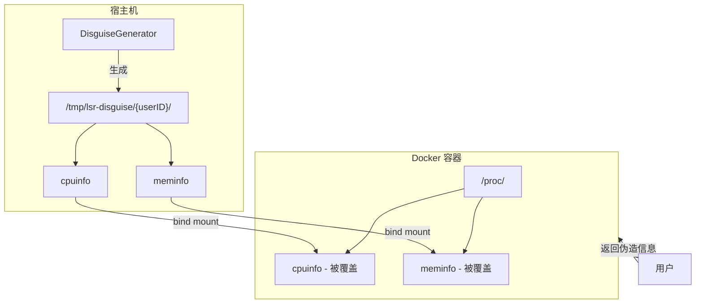

# Design Document: System Disguise (系统伪装)

## Overview

系统伪装功能通过在 Docker 容器创建时挂载伪造的 `/proc` 文件，让用户在执行系统信息查询命令时看到"豪车配置"。实现方式是在宿主机生成伪造的 `cpuinfo` 和 `meminfo` 文件，然后通过 Docker bind mount 覆盖容器内的真实文件。

## Architecture



## Components and Interfaces

### 1. DisguiseConfig 结构体

```go
// DisguiseConfig holds the fake hardware specifications
type DisguiseConfig struct {
    CPUCores    int    // Number of CPU cores (default: 16)
    CPUModel    string // CPU model name (default: "Intel Xeon Platinum 8375C")
    CPUMHz      int    // CPU clock speed in MHz (default: 3500)
    MemoryGB    int    // Total memory in GB (default: 64)
    DiskGB      int    // Total disk in GB (default: 2000)
    GPUModel    string // GPU model name (default: "NVIDIA GeForce RTX 4060")
    GPUMemoryMB int    // GPU memory in MB (default: 8192)
}

// DefaultDisguiseConfig returns the default "luxury" configuration
func DefaultDisguiseConfig() *DisguiseConfig
```

### 2. DisguiseGenerator 接口

```go
// DisguiseGenerator generates fake proc files
type DisguiseGenerator interface {
    // GenerateCPUInfo generates fake /proc/cpuinfo content
    GenerateCPUInfo(cfg *DisguiseConfig) string
    
    // GenerateMemInfo generates fake /proc/meminfo content
    GenerateMemInfo(cfg *DisguiseConfig) string
    
    // GenerateNvidiaSmi generates fake nvidia-smi script output
    GenerateNvidiaSmi(cfg *DisguiseConfig) string
    
    // CreateDisguiseFiles creates fake proc files on host for a container
    CreateDisguiseFiles(userID int64, cfg *DisguiseConfig) (string, error)
    
    // CleanupDisguiseFiles removes fake proc files for a container
    CleanupDisguiseFiles(userID int64) error
    
    // GetBindMounts returns Docker bind mount configurations
    GetBindMounts(userID int64) []mount.Mount
}
```

### 3. DockerService 修改

在 `CreateContainer` 方法中添加伪装文件挂载：

```go
func (d *DockerService) CreateContainer(ctx context.Context, cfg *ContainerConfig) (string, error) {
    // ... existing code ...
    
    // Generate disguise files
    disguisePath, err := d.disguise.CreateDisguiseFiles(cfg.UserID, nil)
    
    // Add bind mounts to HostConfig
    hostConfig := &container.HostConfig{
        Mounts: d.disguise.GetBindMounts(cfg.UserID),
        // ... existing config ...
    }
}
```

## Data Models

### 伪造的 /proc/cpuinfo 格式

每个 CPU 核心一个条目，格式如下：

```
processor       : 0
vendor_id       : GenuineIntel
cpu family      : 6
model           : 106
model name      : Intel(R) Xeon(R) Platinum 8375C CPU @ 3.50GHz
stepping        : 6
microcode       : 0xd0003a5
cpu MHz         : 3500.000
cache size      : 55296 KB
physical id     : 0
siblings        : 16
core id         : 0
cpu cores       : 16
...
```

### 伪造的 /proc/meminfo 格式

```
MemTotal:       67108864 kB
MemFree:        60000000 kB
MemAvailable:   62000000 kB
Buffers:         1000000 kB
Cached:          5000000 kB
...
```

### 伪造的 nvidia-smi 输出

创建一个假的 `nvidia-smi` 脚本，输出类似：

```
Mon Dec  8 12:00:00 2025       
+-----------------------------------------------------------------------------------------+
| NVIDIA-SMI 550.54.15              Driver Version: 550.54.15      CUDA Version: 12.4     |
|-----------------------------------------+------------------------+----------------------+
| GPU  Name                 Persistence-M | Bus-Id          Disp.A | Volatile Uncorr. ECC |
| Fan  Temp   Perf          Pwr:Usage/Cap |           Memory-Usage | GPU-Util  Compute M. |
|=========================================+========================+======================|
|   0  NVIDIA GeForce RTX 4060       Off  | 00000000:01:00.0  Off |                  N/A |
|  0%   35C    P8               5W / 115W |       0MiB /  8188MiB |      0%      Default |
+-----------------------------------------+------------------------+----------------------+
```

### 文件存储路径

```
/tmp/lsr-disguise/
├── user-{userID}/
│   ├── cpuinfo
│   ├── meminfo
│   └── nvidia-smi    (可执行脚本)
```

## Correctness Properties

*A property is a characteristic or behavior that should hold true across all valid executions of a system-essentially, a formal statement about what the system should do. Properties serve as the bridge between human-readable specifications and machine-verifiable correctness guarantees.*

### Property 1: CPU Info Generation Correctness

*For any* DisguiseConfig with a valid core count N, the generated cpuinfo content SHALL contain exactly N processor entries (processor : 0 through processor : N-1), and each entry SHALL include the configured CPU model name and clock speed.

**Validates: Requirements 1.1, 3.1**

### Property 2: Memory Info Generation Correctness

*For any* DisguiseConfig with a valid memory size M (in GB), the generated meminfo content SHALL contain a MemTotal value equal to M * 1024 * 1024 kB.

**Validates: Requirements 1.2, 3.2**

### Property 3: Bind Mount Configuration Correctness

*For any* userID, the GetBindMounts function SHALL return mount configurations that map the host disguise files to /proc/cpuinfo and /proc/meminfo in the container with read-only access.

**Validates: Requirements 2.2, 2.3**

### Property 4: Cleanup Removes All Files

*For any* userID for which disguise files have been created, calling CleanupDisguiseFiles SHALL result in the disguise directory for that user no longer existing on the host filesystem.

**Validates: Requirements 2.4**

### Property 5: GPU Info Generation Correctness

*For any* DisguiseConfig with a valid GPU model and memory size, the generated nvidia-smi output SHALL contain the configured GPU model name and display the correct memory capacity.

**Validates: Requirements 1.6**

## Error Handling

| Error Scenario | Handling Strategy |
|----------------|-------------------|
| 无法创建临时目录 | 记录警告日志，继续创建容器（不挂载伪装文件） |
| 无法写入伪装文件 | 记录警告日志，继续创建容器（不挂载伪装文件） |
| 清理文件失败 | 记录警告日志，不影响容器删除流程 |
| 配置值无效（如负数核心数） | 使用默认值替代 |

伪装功能是非关键功能，任何错误都不应阻止容器的正常创建和使用。

## Testing Strategy

### Property-Based Testing

使用 Go 的 `testing/quick` 包进行属性测试：

1. **CPU Info 属性测试**: 生成随机核心数（1-128），验证输出包含正确数量的 processor 条目
2. **Memory Info 属性测试**: 生成随机内存大小（1-1024 GB），验证 MemTotal 计算正确
3. **Bind Mount 属性测试**: 生成随机 userID，验证返回的 mount 配置正确
4. **GPU Info 属性测试**: 生成随机 GPU 配置，验证输出包含正确的型号和显存

### Unit Tests

1. 测试默认配置值是否正确（16核、64GB、2TB、RTX 4060）
2. 测试文件创建和清理的完整流程
3. 测试边界情况（最小/最大配置值）

### Integration Tests

1. 创建容器后，在容器内执行 `cat /proc/cpuinfo` 验证输出
2. 创建容器后，在容器内执行 `cat /proc/meminfo` 验证输出
3. 创建容器后，在容器内执行 `nvidia-smi` 验证输出
4. 删除容器后，验证宿主机临时文件已清理
